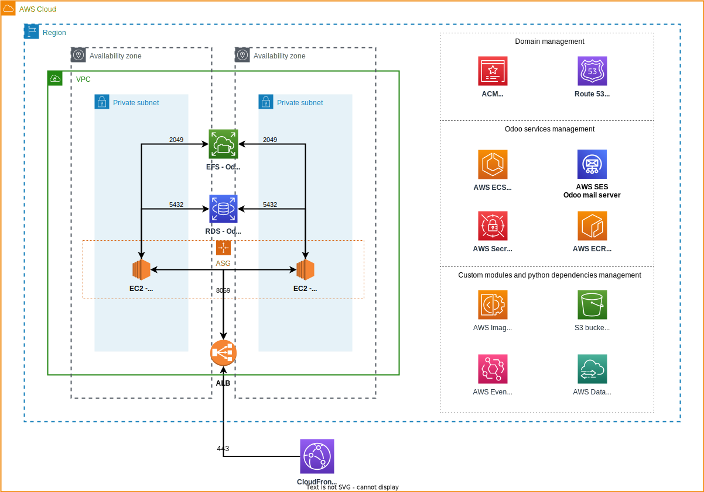

<!-- BEGIN_TF_DOCS -->
# Odoo in AWS

This module deploys [odoo](https://odoo.com) in [AWS](https://aws.amazon.com/) using:

- **ECS** backed with EC2 to run the containerized version of odoo server
- **RDS** for the postgres database
- **EFS** as a filesystem for odoo's filestore
- **SES** as a [mail gateway](docs/ses_as_mail_gateway.md)
- **CloudFront** as a CDN with cache capabilities
- **Secrets Manager** to store credentials

To [manage custom modules](docs/custom_modules_management.md):

- **S3** to store custom modules files
- **EventBridge** to manage event driven actions
- **DataSync** to sync S3 custom module files to EFS
- **ECR** to store a custom docker image in case of extra python dependencies
- **ImageBuilder** to define a build pipeline for a custom docker image
- **SSM automations** to execute DataSync tasks and ImageBuilder pipelines

## Architecture reference



## Requirements

| Name | Version |
|------|---------|
| <a name="requirement_terraform"></a> [terraform](#requirement_terraform) | >= 1.5.2 |
| <a name="requirement_aws"></a> [aws](#requirement_aws) | >= 5.00 |
| <a name="requirement_random"></a> [random](#requirement_random) | >= 3.1.0 |

## Modules

| Name | Source | Version |
|------|--------|---------|
| <a name="module_acm"></a> [acm](#module_acm) | terraform-aws-modules/acm/aws | ~> 4.0 |
| <a name="module_alb"></a> [alb](#module_alb) | terraform-aws-modules/alb/aws | ~> 8.0 |
| <a name="module_autoscaling"></a> [autoscaling](#module_autoscaling) | terraform-aws-modules/autoscaling/aws | ~> 6.5 |
| <a name="module_autoscaling_sg"></a> [autoscaling_sg](#module_autoscaling_sg) | terraform-aws-modules/security-group/aws | ~> 5.0 |
| <a name="module_cdn"></a> [cdn](#module_cdn) | terraform-aws-modules/cloudfront/aws | ~> 3.2 |
| <a name="module_datasync_role"></a> [datasync_role](#module_datasync_role) | terraform-aws-modules/iam/aws//modules/iam-assumable-role | ~> 5.27 |
| <a name="module_db"></a> [db](#module_db) | terraform-aws-modules/rds/aws | ~> 6.1 |
| <a name="module_db_security_group"></a> [db_security_group](#module_db_security_group) | terraform-aws-modules/security-group/aws | ~> 5.0 |
| <a name="module_ecs_cluster"></a> [ecs_cluster](#module_ecs_cluster) | terraform-aws-modules/ecs/aws | ~> 5.2 |
| <a name="module_ecs_service"></a> [ecs_service](#module_ecs_service) | terraform-aws-modules/ecs/aws//modules/service | ~> 5.2 |
| <a name="module_efs"></a> [efs](#module_efs) | terraform-aws-modules/efs/aws | ~> 1.2 |
| <a name="module_eventbridge"></a> [eventbridge](#module_eventbridge) | terraform-aws-modules/eventbridge/aws | ~> 2.3.0 |
| <a name="module_image_builder_role"></a> [image_builder_role](#module_image_builder_role) | terraform-aws-modules/iam/aws//modules/iam-assumable-role | ~> 5.27 |
| <a name="module_image_builder_sg"></a> [image_builder_sg](#module_image_builder_sg) | terraform-aws-modules/security-group/aws | ~> 5.0 |
| <a name="module_lambda_image_builder"></a> [lambda_image_builder](#module_lambda_image_builder) | terraform-aws-modules/lambda/aws | ~> 6.0.0 |
| <a name="module_s3_bucket"></a> [s3_bucket](#module_s3_bucket) | terraform-aws-modules/s3-bucket/aws | ~> 3.14 |
| <a name="module_ses_user"></a> [ses_user](#module_ses_user) | terraform-aws-modules/iam/aws//modules/iam-user | ~> 5.27 |
| <a name="module_vpc"></a> [vpc](#module_vpc) | terraform-aws-modules/vpc/aws | ~> 5.0 |

## Usage

```hcl
# Simple usage
module "odoo_simple" {
  source = "git@github.com:renaiss-io/terraform-aws-odoo.git"

  name = "odoo"
  tags = { "Environment" : "prod" }
}

# You can use a domain hosted in route 53 for odoo
# 1. Provide the hosted zone id and the module will create the required records
# 2. (optional) use a subdomain instead of the root domain of route 53
module "odoo_custom_domain" {
  source = "git@github.com:renaiss-io/terraform-aws-odoo.git"

  route53_hosted_zone = "Z01208793QY6JAD0UY432"
  odoo_domain         = "odoo.example.com"
}
```

**Usage outside us-east-1**
```hcl
provider "aws" { region = "us-east-2" }

provider "aws" {
  region = "us-east-1"
  alias  = "use1"
}

# When deploying outside us-east-1 and using a custom domain
# an ACM cert is required in us-east-1 for the cdn.
# The cert must be created externally and sent to the module
# in the var.acm_cert_use1 variable
module "odoo_simple" {
  source = "git@github.com:renaiss-io/terraform-aws-odoo.git"

  route53_hosted_zone = "Z01208793QY6JAD0UY432"
  odoo_domain         = "odoo.example.com"
  acm_cert_use1       = module.acm.acm_certificate_arn
}

# This represents the ACM cert in us-east-1 created outside
# the odoo module
module "acm" {
  source  = "terraform-aws-modules/acm/aws"
  version = "~> 4.0"

  provider = { aws = aws.use1 }

  domain_name               = "example.com"
  zone_id                   = "Z01208793QY6JAD0UY432"
  wait_for_validation       = true
  subject_alternative_names = ["*.example.com"]
}
```

**Usage with custom modules**
```hcl
module "odoo_custom_modules" {
  source = "git@github.com:renaiss-io/terraform-aws-odoo.git"

  # Custom modules files
  # If this var is provided, the files are stored in s3
  # and synced to EFS with DataSync
  odoo_custom_modules_paths = ["./custom_modules"]

  # Custom python packages
  # If this var is provided, a custom docker image is
  # created and maintained in ECR
  python_requirements_file = "./requirements.txt"
}
```

> Important! For simplicity, the examples do not point to a
> specific version of the module. For a production deployment,
> it is suggested that you point to a specific version tag like:
>
> **source = "git<span>@</span>github.com:renaiss-io/terraform-aws-odoo.git?ref=v1.0.0"**

## Inputs

| Name | Description | Type | Default | Required |
|------|-------------|------|---------|:--------:|
| <a name="input_odoo_root_email"></a> [odoo_root_email](#input_odoo_root_email) | Root email to use, must be validated in SES | `string` | n/a | yes |
| <a name="input_acm_cert_use1"></a> [acm_cert_use1](#input_acm_cert_use1) | If using custom domain and deploying outside us-east-1, a cert in us-east-1 for the domain is required | `string` | `null` | no |
| <a name="input_cdn_price_class"></a> [cdn_price_class](#input_cdn_price_class) | Price class for CDN | `string` | `"PriceClass_100"` | no |
| <a name="input_datasync_preserve_deleted_files"></a> [datasync_preserve_deleted_files](#input_datasync_preserve_deleted_files) | Datasync preserves old files not present in S3 | `bool` | `false` | no |
| <a name="input_db_instance_type"></a> [db_instance_type](#input_db_instance_type) | Instance type for DB instances | `string` | `"db.t4g.micro"` | no |
| <a name="input_db_max_size"></a> [db_max_size](#input_db_max_size) | Max size of DB (var.db_size will be allocated and autoscale will be enabled) | `number` | `100` | no |
| <a name="input_db_root_username"></a> [db_root_username](#input_db_root_username) | DB root username | `string` | `"odoo"` | no |
| <a name="input_db_size"></a> [db_size](#input_db_size) | DB size (in GB) | `number` | `20` | no |
| <a name="input_ecs_container_insights"></a> [ecs_container_insights](#input_ecs_container_insights) | Enable container ingsights in ECS (not inside free tier) | `bool` | `false` | no |
| <a name="input_ecs_instance_type"></a> [ecs_instance_type](#input_ecs_instance_type) | Instance type for ECS instances | `string` | `"t3.micro"` | no |
| <a name="input_ecs_task_memory"></a> [ecs_task_memory](#input_ecs_task_memory) | Memory to allocate for the task (in GB) | `number` | `400` | no |
| <a name="input_extra_files_filter"></a> [extra_files_filter](#input_extra_files_filter) | Paths to ignore when processing modules and python dependencies | `list(string)` | <pre>[<br>  ".git"<br>]</pre> | no |
| <a name="input_init_modules"></a> [init_modules](#input_init_modules) | Initialize some modules upon deployment success | `list(string)` | `[]` | no |
| <a name="input_load_language"></a> [load_language](#input_load_language) | Allow automatic installation of a language. List of languages available at https://github.com/odoo/odoo/blob/16.0/odoo/tools/translate.py | `list(string)` | `[]` | no |
| <a name="input_name"></a> [name](#input_name) | A name to use in all resources | `string` | `"odoo"` | no |
| <a name="input_no_database_list"></a> [no_database_list](#input_no_database_list) | Enable/Disable exposing DB management capabilities in the login page | `bool` | `true` | no |
| <a name="input_odoo_custom_modules_paths"></a> [odoo_custom_modules_paths](#input_odoo_custom_modules_paths) | Paths containing custom modules to install | `list(string)` | `[]` | no |
| <a name="input_odoo_db_name"></a> [odoo_db_name](#input_odoo_db_name) | Main odoo DB name | `string` | `"odoo"` | no |
| <a name="input_odoo_docker_image"></a> [odoo_docker_image](#input_odoo_docker_image) | Odoo docker image to use | `string` | `"bitnami/odoo"` | no |
| <a name="input_odoo_domain"></a> [odoo_domain](#input_odoo_domain) | If route53 is set, use this var to use a subdomain instead of the root domain. Must be subdomain of the provided domain | `string` | `null` | no |
| <a name="input_odoo_python_dependencies_paths"></a> [odoo_python_dependencies_paths](#input_odoo_python_dependencies_paths) | Paths containing python dependencies | `list(string)` | `[]` | no |
| <a name="input_odoo_version"></a> [odoo_version](#input_odoo_version) | Version of odoo docker image to use | `string` | `"16"` | no |
| <a name="input_python_requirements_file"></a> [python_requirements_file](#input_python_requirements_file) | Path to a requirements.txt file with extra libraries to install in python environment | `string` | `null` | no |
| <a name="input_route53_hosted_zone"></a> [route53_hosted_zone](#input_route53_hosted_zone) | If provided, the hosted zone is used as domain for odoo | `string` | `null` | no |
| <a name="input_tags"></a> [tags](#input_tags) | A mapping of tags to assign to resources | `map(string)` | `{}` | no |
| <a name="input_vpc_cidr"></a> [vpc_cidr](#input_vpc_cidr) | IP range to assign to VPC | `string` | `"10.0.0.0/16"` | no |

## Outputs

| Name | Description |
|------|-------------|
| <a name="output_dns"></a> [dns](#output_dns) | DNS to access odoo |

## Supporting documentation

- [Domain management](./docs/domain_management.md)

- [Custom modules management](./docs/custom_modules_management.md)

- [SES configuration](./docs/ses_as_mail_gateway)

- [Costs of running Odoo in AWS](./docs/costs.md)
<!-- END_TF_DOCS -->