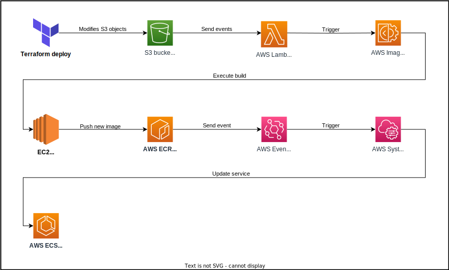
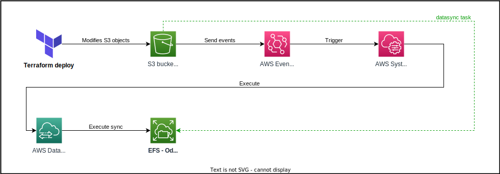

# Odoo Custom Modules

Odoo custom modules can be installed in the infrastructure deployed with this module. For that, two different processes are exposed through variables:

## Custom python dependencies

When using custom modules, the python environment running odoo server might need extra packages installed. The default docker image used by this module is `bitnami/odoo:16`, which has all the default dependencies needed for the community version of odoo in a python venv installed in `/opt/bitnami/odoo/venv`.

When a `requirements.txt` file is provided through the `python_requirements_file` variable, some resources are created to be able to create and use a new docker image based on the bitnami one:

- [An **AWS ImageBuilder** pipeline with instructions to build a new docker image](../custom_modules.tf#L195-L348)
- [An **AWS ECR** repository to store the new image](../custom_modules.tf#L206-L217)
- [A **S3** bucket to store the new requirements file](../custom_modules.tf#L14-L21)
- [**EventBridge** and **SSM Automations** to trigger the build](../custom_modules.tf#L411-L430)

### Process reference:

1. When the `requirements.txt` file is created (or modified) as an object in the S3 bucket, a notification is sent to EventBridge (dependencies are set in the module to avoid missing the first creation of the file in S3). A rule is created to listen to this changes and execute a build through ImageBuilder.

2. ImageBuilder is configured to build a new image based in the bitnami one and push it to the ECR repository. The steps of the build simply downloads the requirements file and install it after activating the corresponding virtual environment (there is an extra step to install git in the image, required to install python packages directly from git repositories).

3. Once the new image is pushed to ECR, a new notification is sent and handled by EventBridge rules, but this time this executes an automation to replace the current task running in ECS to update the base image used by odoo servers (this is accomplished by forcing a new deployment of the ECS service).

> The ImageBuilder pipeline is also configured to run periodically if changes are detected in the source image. Step 3 is also triggered in this case.

## Custom modules

To install custom modules, we need to store the source code of the modules in a place accessible by the odoo server processes. To do this, the variable `odoo_custom_modules_paths` allows to send a list of directories where the custom modules' source code is.

> The paths sent to this variable should not be the path to the modules, but to a [parent folder containing the modules](../examples/complete/main.tf#L30) to be installed.
> This is behavior is intended so we can clone repositories containing custom modules code and point to them.
> It is suggested to version the code used to deploy and point to the custom modules repositories with git submodules.

In addition, if python packages must be provided with the compiled source code (for example for private packages or packages not available to be installed with pip), an extra variable `odoo_python_dependencies_paths` is provided to send python packages that will be installed by copying them in an extra packages folder pointed in the odoo servers containers with the `PYTHONPATH` environment variable.

> This is not the recommended way of customizing the packages installed in the python virtual environment used by odoo, it is exposed for specific use cases.
> If possible, prefer to use the `python_requirements_file` variable.

In these two cases, some extra resources are created to install these files:

- [A **S3** bucket to store files](../custom_modules.tf#L14-L21)
- [**AWS DataSync** locations and tasks to sync s3 objects to EFS](../custom_modules.tf#L112-L192)
- [**EventBridge** and **SSM automation** resources to use as triggers of the sync tasks](../custom_modules.tf#L432-L472)

### Process reference:

1. Terraform maintains the files provided synced with a S3 bucket created to store them. Files are stored in two directories (`modules/` and `python/`) to be able to execute sync tasks separately.

2. When any change in these directories is detected by EventBridge, DataSync tasks are executed through SSM automations and the files are synced to the EFS used by odoo containers to persist data.

3. Once the files are synced, the python packages are already available to be used by the python virtual environment; and a `Update Apps List` action can be executed from the odoo app to refresh the modules installed.
