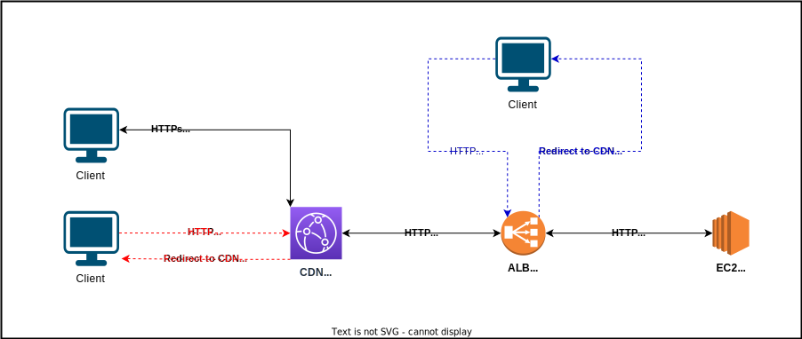

# Odoo Domain

Odoo deployment has two public endpoints: **CloudFront distribution** and **Application Load Balancer** domains. Clients will access Odoo from the CloudFront distribution, and the load balancer limit its access to that distribution as the origin only (any connection that is not originated from the cdn will be redirected to it).

## Default domains

- **Domains**: default domains of cloudfront and load balancer are used.
- **SSL**: default cert of cloudfront is used in the cdn and no cert is used in load balancer.
- **Client**: client will only be allowed to access odoo through HTTPs to the CDN. Accessing CDN in HTTP or load balancer directly will result in a redirect to the CDN in the proper protocol.
- **CDN to ALB**: to ensure that the load balancer is accessed by the CDN, the load balancer listener checks for two headers: `CloudFront-Access` containing a secret value randomly created by terraform, and `Host` expecting a value equal to the default domain of the CDN.

> In this scenario the communication between the CDN and the ALB is not encrypted, therefore the secret header only known by the CDN could be intercepted.
> This does not represent a threat since the restriction of access to the ALB directly is only set for the cache behavior and cause the host header value is important for odoo.
> Anyone accessing the ALB will have to set the secret header and the host header to the proper values, only being able to bypass the cache layer.

## Custom domains

A custom domain can be provided, at the moment only domains hosted in Route 53 as a valid public zone are supported and can be sent as the domain to use with the `route53_hosted_zone` variable.

The variable `odoo_domain` allows to set the domain to be used instead of the root domain of the route 53 hosted zone (it must be set to a subdomain of the root domain).

- **Domains**: the hosted zone root domain (or the optional subdomain) is set as the CDN alias, and a subdomain `alb.` of that domain is used for the ALB.
- **SSL**: ACM certs are used for the CDN and the ALB. If deploying outside `us-east-1`, the CDN cert must be provided externally.
- **Client**: client will only be allowed to access odoo through HTTPs to the CDN. Accessing CDN in HTTP or load balancer directly will result in a redirect to the CDN in the proper protocol.
- **CDN to ALB**: to ensure that the load balancer is accessed by the CDN, the load balancer listener checks for two headers: `CloudFront-Access` containing a secret value randomly created by terraform, and `Host` expecting a value equal to the custom domain of the CDN.
